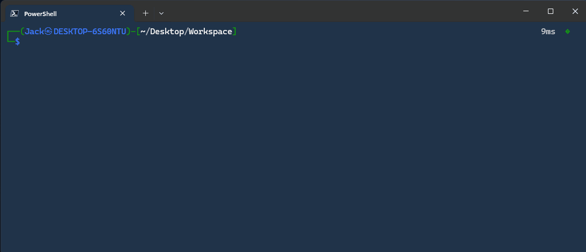

# 🛡️ ADcheck

> **Active Directory Security Assessment & Attack Surface Analysis**  
> An open-source penetration testing tool to evaluate AD security, identify misconfigurations, and map exploitation paths before attackers do.

[](https://www.python.org)
[](LICENSE)

---

## 🔍 The Hidden Risks of Active Directory

Over time, every Active Directory environment accumulates operational and security debt.

What often begins as a well structured and controlled infrastructure gradually degrades through years of:
- 🚫 Orphaned test and temporary accounts
- 🚫 Service accounts that are never reviewed or decommissioned
- 🚫 Excessive or misconfigured delegations
- 🚫 Weak or inconsistent password policies
- 🚫 Privileged group memberships left unchanged for extended periods

This lack of continuous governance often amplified by team turnover and insufficient visibility significantly expands the attack surface.

The result is an environment that appears compliant and secure on paper, yet conceals critical weaknesses that enable **lateral movement, persistence, and privilege escalation** for both internal and external attackers.

---

## 💡 Why ADcheck?

While **PingCastle**, **PurpleKnight**, and **ORADAD** are excellent tools, they have fundamental limitations:

| Aspect | PingCastle / PurpleKnight | ORADAD | ADcheck |
|--------|---------------------------|--------|---------|
| **Open Source** | Licensed | Yes | Yes |
| **Focus** | Compliance & Maturity Scoring | Data Collection Only | Attack Surface |
| **Actionable Results** | Maturity Reports | Manual Analysis Required | Direct Interpretation |
| **Platform** | Windows Only | Windows Only | Cross-Platform |
| **Pentest-Oriented** | Limited | Limited | Built for Pentesters |

---

## 🎯 What ADcheck Does

ADcheck doesn't measure domain "maturity" it **analyzes your attack surface**:

✓ **What are the administrative flaws?**  
✓ **Which delegations can be abused?**  
✓ **What accounts pose real compromise risk?**  
✓ **What lateral movement paths exist?**  

The output provides direct interpretation, not raw data answers you can act on immediately.

---

## 📊 80+ Security Controls Across 4 Categories

### 👤 User Account Management

Detect account-level vulnerabilities and misconfigurations:
<details>
  <summary>Click to expand/collapse</summary>

- [x] Admin accounts that can be delegated
- [x] Admin accounts not in "_Protected Users_" group
- [x] Accounts which can use DES authentication
- [x] Accounts vulnerable to ASRepRoasting attack
- [x] Accounts with `altSecurityIdentities` attributes
- [x] Accounts with `userPassword` attributes
- [x] Accounts with `unixUserPassword` attributes
- [x] Accounts with `unicodePwd` attributes
- [x] Accounts with `msDS-HostServiceAccount` attribute
- [x] Accounts with blank password
- [x] Accounts vulnerable to KerbeRoasting attack
- [x] Locked accounts
- [x] Number of accounts which have never expiring passwords
- [x] Number of accounts with identical passwords
- [x] Number of inactive accounts
- [x] Number of accounts in "_Schema Admins_" group
- [x] Accounts which have reversible passwords
- [x] Accounts vulnerable to timeroasting attack
- [x] Accounts that had admin rights in the past
- [x] Accounts with password not required
- [x] Name of Pre-Windows 2000 Compatible Access group members
- [x] Get List of users in Privesc group
- [x] Get Users with description
- [x] Verify if The native administrator account has been used recently
- [x] Get Group Managed Service Accounts

</details>

### 🔐 Audit & Policy Management (30+ checks)

Verify security policy compliance and endpoint hardening:
<details>
  <summary>Click to expand/collapse</summary>

- [x] Get Audit Policy
- [x] Get Default password policy
- [x] Get Group Policy Object by Organizational Unit
- [x] Name of Group Policy containing a password
- [x] Verify if Force logoff when logon hours expire
- [x] Verify if MSI packages are always installed with elevated privileges
- [x] Verify if CredentialGuard is enabled
- [x] Verify if LM hash storage disabled
- [x] Verify if Authentication limited to NTLMv2 mechanism only
- [x] Verify if AppLocker rules defined
- [x] Verify if gpp_autologon is enabled
- [x] Verify if Bitlocker is enabled
- [x] Verify if Firewall is disabled
- [x] Verify if IPv4 preferred over IPv6
- [x] Verify if LLMNR, NetBIOS or mDNS is enabled
- [x] Verify if Too many logons are kept in the LSA cache
- [x] Verify if Lsass runs as a protected process
- [x] Verify if Powershell v2 is enabled
- [x] Verify if Powershell events are logged
- [x] Verify if Powershell is configured in Restricted mode
- [x] Verify if RDP use NLA
- [x] Verify if RDP is secured over pass the hash attack
- [x] Verify if RDP session timeout is too short
- [x] Verify if UAC configuration is secure
- [x] Verify if WDigest authentication enabled
- [x] Verify if WPAD is disabled
- [x] Verify if Windows Script Host is disabled
- [x] Verify if WSUS server is not used
- [x] Get Name of AMSI installed
- [x] Trusted Root Certification Authorities status

</details>

### 🖥️ Infrastructure & Domain (18+ checks)

Assess domain-wide architecture and security posture:
<details>
  <summary>Click to expand/collapse</summary>

- [x] Computers with bitlocker keys
- [x] Get Domain Controllers
- [x] Get Functional level of domain
- [x] Get Kerberos config
- [x] Verify if Non-admin users can add up to 10 computer(s) to a domain
- [x] Get Supported Kerberos encryption algorithms
- [x] Verify if Kerberos password last changed < 40 days
- [x] Verify if LAPS is installed
- [x] Get Password Settings Object
- [x] Verify if Recycle Bin is enabled
- [x] Verify if The computer was recently backed up
- [x] Verify if The computer is up to date
- [x] Get Supported encryption by Domain Controllers
- [x] Verify if SMB signing is required
- [x] Verify if Spooler service is enabled on remote target
- [x] Verify if LDAP signature was required on target
- [x] Verify if Channel binding is enforced
- [x] Ldap anonymous bind
- [x] DFSR SYSVOL

</details>

### 🔑 Privileges & Delegations (10+ checks)

Uncover privilege abuse vectors and delegation chains:
<details>
  <summary>Click to expand/collapse</summary>
  
- [x] Registry access rights
- [x] Get Control delegations by container
- [x] Get Privilege Rights (SeDebugPrivilege, SeBackupPrivilege, ...)
- [x] Get Authentication policy silos
- [x] Name of Trust accounts for the delegation
- [x] Name of Computers with rbac
- [x] Verify if User can create dns record
- [x] Computers with constrained delegation
- [x] Get Group policy folder/file rights
- [x] WinRM authorization
- [x] Share accessible in read/write by everyone

</details>

---

## 📄 Clear, Actionable Output

ADcheck provides readable, structured results with intuitive color-coding:

- 🔴 **Red** → Critical vulnerability or dangerous misconfiguration requiring immediate remediation
- 🟡 **Orange** → Major issue needing prompt attention
- 🟢 **Green** → Secure configuration or compliant setting
- ⚪ **White** → Informational reference data

Each finding is directly interpretable—no manual analysis required.

👉 [View a sample HTML report](https://html-preview.github.io/?url=https://raw.githubusercontent.com/CobblePot59/ADcheck/main/.github/report.html)

---

## 🚀 Quick Start

### Installation

```bash
# 1. Install UV (fastest Python package manager)
pip install uv

# 2. Install ADcheck
uv tool install git+https://github.com/CobblePot59/ADcheck.git

# 3. Run your assessment
ADcheck -d 'example.com' -u 'Administrator' -p 'Password1' --dc-ip '192.168.1.1'
```

### For Developers

```bash
# 1. Clone the repository
git clone https://github.com/CobblePot59/ADcheck.git
cd ADcheck

# 2. Install dependencies with UV
uv sync

# 3. Run your assessment
uv run adcheck -d 'example.com' -u 'Administrator' -p 'Password1' --dc-ip '192.168.1.1'
```



---

## 🛠️ Roadmap

Planned enhancements:

- [ ] Trusts
- [ ] Azure (Entra ID)
- [ ] Persistent attack trace (mimikatz, certipy, ticket, dsrm, acl)
- [ ] List of Named pipes
- [ ] Verify if Spooler service is enabled on remote target
- [ ] Outputs a human readable summary of acls

---

## ⚠️ Important:

Before running :
- **Use a dedicated testing machine** when possible
- **Verify authorization** for Active Directory auditing
- **Notify security/infrastructure teams** before running assessments

**Best Practices:**
- Archive reports for historical trend analysis
- Share findings with infrastructure and security teams for prioritized remediation
- Use results to reconstruct real-world attack scenarios and improve defenses

---
